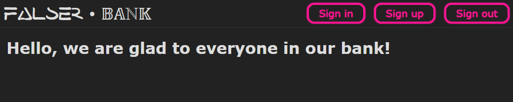
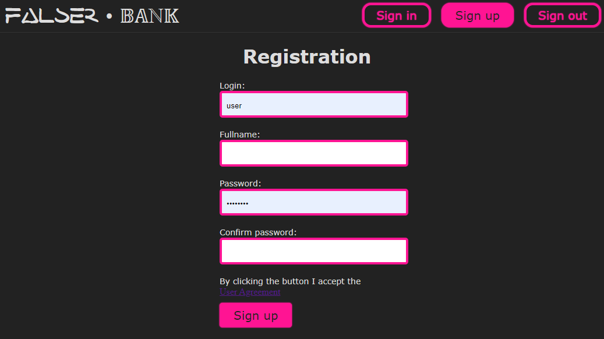
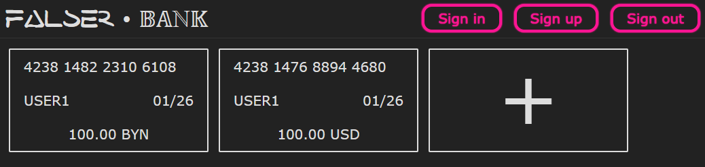
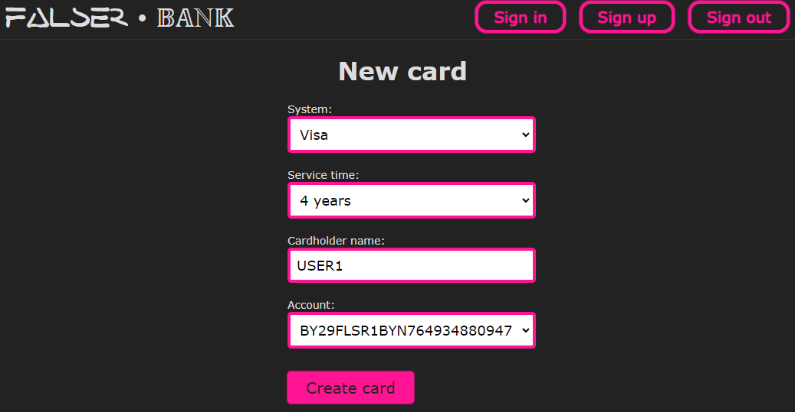
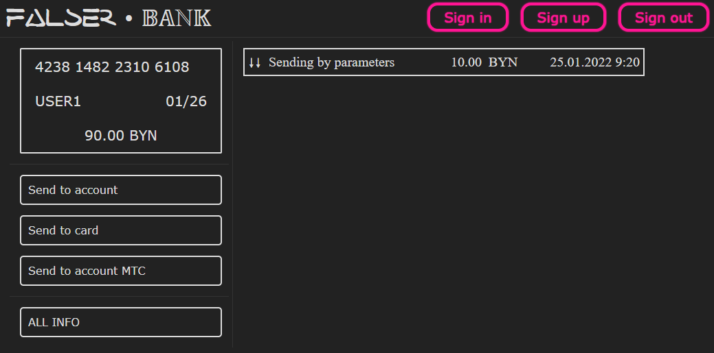
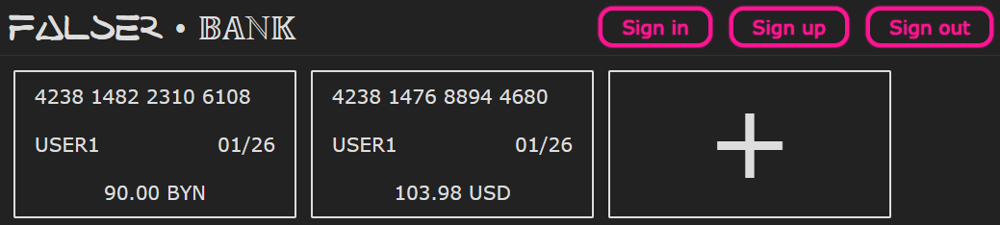

# FalseR • 𝔹𝔸ℕ𝕂

**Django** server with **PostgreSQL** database

## Installation

### Windows:

```shell
python -m venv venv
venv\Scripts\activate.bat
pip install -r requirements.txt
```

### Linux:

```shell
python3 -m venv venv
source venv\bin\activate
pip install -r requirements.txt
```

## Tuning
```shell
cd dj
python manage.py migrate
python manage.py createsuperuser
```
Also, you need to add currencies and default courses (BYN / CUR * 1 000 000) in admin panel

## Running

```shell
python manage.py runserver
```

## Or with using docker

```shell
sudo docker-compose build
sudo docker-compose up
```


## Screenshots







